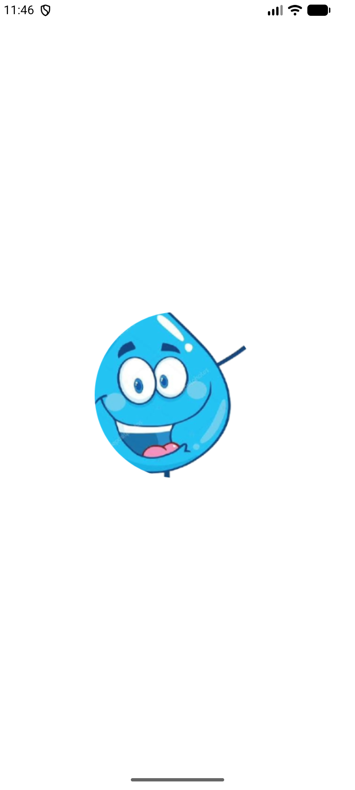
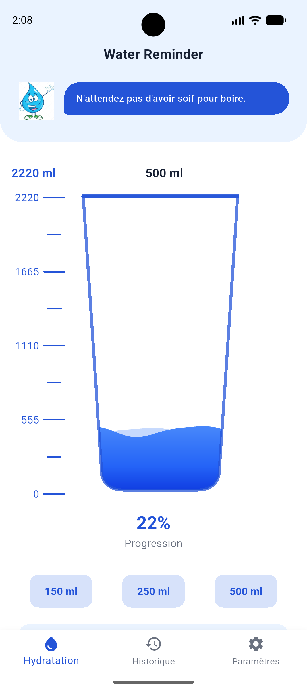
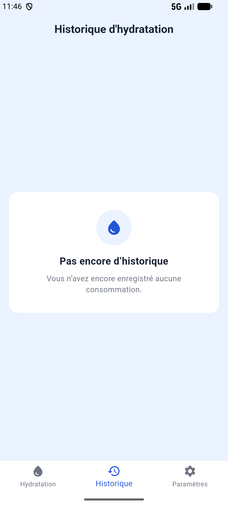
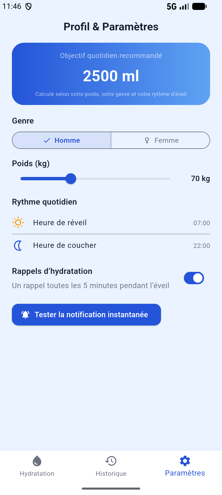

# Water Reminder

> **FlutterFire Summer Camp 2026** | **Groupe 30** 

Water Reminder est une application mobile intelligente conçue pour optimiser l'hydratation quotidienne. En se basant sur le profil de l'utilisateur (poids, genre, rythme de sommeil), l'application calcule un objectif sur mesure et planifie des rappels dynamiques pour atteindre cet objectif sans perturber les cycles de repos.

---

## Aperçu de l'Application

<p align="center">
  
  
  
  
</p>

---

## Fonctionnalités Principales

* ** Objectif Dynamique :** Calcul personnalisé de la quantité d'eau requise selon les paramètres physiques (poids, genre).
* ** Smart Notifications :** Moteur de rappels intelligent configuré pour envoyer des alertes régulières *uniquement* pendant les heures d'éveil de l'utilisateur.
* ** Suivi Visuel en Temps Réel :** Jauge dynamique sur la page d'accueil se remplissant à chaque ajout (via boutons rapides ou saisie manuelle).
* ** Persistance Locale :** Sauvegarde instantanée de l'historique d'hydratation et des paramètres grâce à une base de données NoSQL (Hive), rendant l'application 100% fonctionnelle hors-ligne.
* ** Sécurité & UX :** Verrouillage automatique des saisies une fois l'objectif quotidien atteint.

---

##  Architecture & Stack Technique

Le projet respecte rigoureusement les principes de la **Feature-first Clean Architecture**, assurant un code hautement maintenable, testable et séparant clairement la logique métier de l'interface utilisateur.

| Composant | Technologie utilisée | Rôle |
| :--- | :--- | :--- |
| **UI & Framework** | Flutter / Dart | Développement de l'interface fluide et réactive. |
| **State Management**| Riverpod (`NotifierProvider`) | Gestion de l'état asynchrone (Hydratation, Paramètres). |
| **Base de données** | Hive | Stockage local clé-valeur ultra-rapide avec `TypeAdapters`. |
| **Notifications** | `flutter_local_notifications` | Gestion des alarmes natives avec contournement du mode Doze. |

---
### Structure du projet (Feature-first)

L'application est découpée par "fonctionnalités" (features) plutôt que par type de fichiers, ce qui facilite le travail en équipe et la scalabilité.

```text
lib/
├── core/                       
│   ├── database/             
│   ├── notifications/         
│   ├── theme/                
│   └── utils/                 
│
├── features/                   
│   │
│   ├── hydration/              
│   │   ├── data/               
│   │   ├── domain/             
│   │   └── presentation/         
│   │
│   └── settings/              
│      ├── data/               
│      ├── domain/             
│      └── presentation/       
├──main                   
```
## L'Équipe - Groupe 30

Ce projet a été réalisé en collaboration par :

* **yamariel**
* **Supr3m**
* **Godo**
* **Naldo**
* **Kader**
* **Badra**

---

## Installation & Exécution

1. Cloner le dépôt : 
   ```bash
   git clone [URL_DU_REPO]

2. Installer les dépendances :
    ```bash
    flutter pub get

3. Lancer la génération de code (pour les adapters Hive) :
    ```bash
    flutter pub run build_runner build --delete-conflicting-outputs